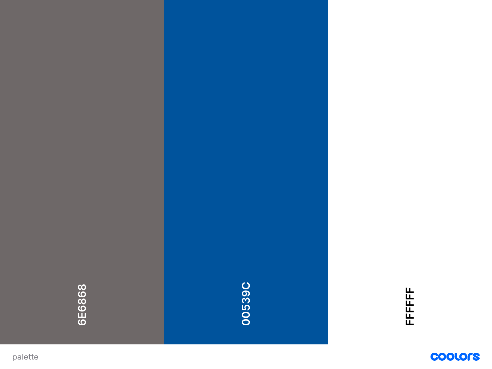

# PCbuilds


 PCbuilds is a made up company with focus on selling a top gaming PC's, while at the same time promotes budged friendly offers.

    

The image above is a screenshot from [Am I Responsive](http://ami.responsivedesign.is/#)

A demo of the website can be found here [sami-sinnari.github.io/MilestoneProject2/](https://sami-sinnari.github.io/MilestoneProject2/)

## Contents

- [**User Experience (UX)**](<#user-experience-(ux)>)

  - [Project Goals](#project-goals)
  - [User Goals](#user-goals)
  - [Design](#design)
  - [Wireframes](#wireframes)

- [**Features**](#features)

  - [Existing Features](#features)
  - [Features Left to Implement](#features)

- [**Technologies**](#technologies-used)

  - [Languages Used](#technologies-used)
  - [Frameworks, Libraries and Programs Used](#technologies-used)

- [**Testing**](#testing)

- [**Deployment**](#deployment)

- [**Credits**](#credits)

---


## User Experience (UX)

### Project Goals

> - Highlight the main values of our team to convince the customers to buy from us.
> - Showcase some of our previous PC designs, in order to attract the customer.
> - Obtaining subscriptions for mailing list, thereby increasing customer databases.
> - Directions to Facebook, Instagram and Twitter in order to interact more with customers.

### User Goals 

> - _"I don't have a PC or Laptop at home and so I mostly do my reaserch on a mobile phone"_
> - _"I want to see some of their previous PC designs before ordering"_
> - _"I want to get in touch with the company because i'd like to add some feature in a PC"_
> - _"I want to be able to subscribe to PCbuilds so I can get update on their future computers."_
> - _"I want to be able to join a facebook/instagram or twitter page so I can get to know the company"_
> - _"I would like to buy from them, but I'd love too see what else they offer"_


### Site Owner Goals :

> - Create a responsive website as some customers do not use different devices.
> - Create a gallery section where customers can navigate through pictures.
> - Create a "Contact Us" section, to assure customers we can always upgrade PC based on their needs.
> - Create a "Subscribe" card in order to keep subscribers up-to-date with our latest releases.
> - Create a Social links buttons at the end of the page so they can follow us.
> - Create a vast "Order here" page, with various PC builds and cart.

### Design
> - The main focus of the design is to allow the customers to aquire the information they need in order to purchase a product from our company. Short paragraphs of content were added just to provide enough details, and highligted are four cards which display the main core values of the company. Top quality images are showcased in order to attract the customer. Nevertheless, points of contact are provided via "Contact Us" page and Social media links in "Subscribe" card.


#### Colors

 For this project I decided to use only three colors, as the main focus was simplicity. 



#### Typography

 > - I have used two fonts from [Google Fonts](https://fonts.google.com/) on the website. 
 > 1. Rokkitt (fall-back font Serif) - The Standard attractive look of the font was used in headings and Order Page layout, as in my opinion it fits perfectly to achive a professional lok.
 > 2. Architects Daughter (fall-back font Serif) - Not so standard look was chosen as it gives a nice balanced diversity on the website.

### Wireframes

#### Mobile view

>- [Front Page](https://github.com/sami-sinnari/MilestoneProject2/blob/master/assets/wireframes/website-mobile.pdf)    
>- [Order Page](https://github.com/sami-sinnari/MilestoneProject2/blob/master/assets/wireframes/orderpage-mobile.pdf)

#### Desktop view

>- [Front Page](https://github.com/sami-sinnari/MilestoneProject2/blob/master/assets/wireframes/website-desktop.pdf)  
>- [Order Page](https://github.com/sami-sinnari/MilestoneProject2/blob/master/assets/wireframes/orderpage-desktop.pdf)


#### [Back to Contents](#contents)

---

## Features

### Existing Features : 

> - Navigation : Navigation bar made with JS is designed in a way that it will follow the user where he/she goes. Hamburger menu will slide from right to left with navigation links included. It consists of six links : **Home**, **About Us**, **Gallery**, **Order Now**, **Contact** and **Subscribe**.
> - One-page website with 6 sections and one seperate page for order section.
> - Order page which containes products. Products can be added to the cart and their number can be increased or decreased. The price of the product will change as customer is changing the amount. If customer goes to Home page, products will be saved in the cart as they are stored. JSON used in that section.
> -  Footer which containes **Subscribe** card and **Social links**

### Features Left to Implement when relevant knowledge gained :

> - I would like to connect the **Purchase** button in Order Now page with [Stripes](https://stripe.com/docs/connect/creating-a-payments-page) **Crate a payment page**.
> - I would like to expand the store of this website and add more sections with different IT products and PC connected gadgets.


#### [Back to Contents](#contents)

---

## Technologies Used

### Languages

>  [HTML5](https://en.wikipedia.org/wiki/HTML5)
>
>  [CSS3](https://en.wikipedia.org/wiki/Cascading_Style_Sheets)
>
>  [JavaScript](https://en.wikipedia.org/wiki/JavaScript)

### Frameworks, Libraries and Programs:

>  [Font Awesome](https://fontawesome.com/) - Font awesome was used in order to add icons to social links and whole of the cart.

> [Google Fonts](https://fonts.google.com/) - Google fonts were used to add font to the website.

>  [VSCode](https://code.visualstudio.com/) - VS Code was used to code the project alongside GitPod. 

>  [Balsamiq](https://balsamiq.com/) - Balsamiq was used to create the wireframes for desktop, mobile and tablet view.

>  [GitHub](https://github.com/) - GitHub was used to store the code that was pushed from VScode.

>  [Gitpod](https://www.gitpod.io/) - Gitpod was used to code the project alongside VSCode.

#### [Back to Contents](#contents)

---

## Testing

### Code validity
> - HTML - [W3C](https://validator.w3.org/) - Markup Validation
> - CSS - [W3C](https://jigsaw.w3.org/css-validator/) - CSS Validation
> - JavaScript - [JSHINT](https://jshint.com/) - Javascript code check
> - TAGS - [Closing Tag Checker for HTML5](https://www.aliciaramirez.com/closing-tags-checker/) - Validates if all tags are opened and closed correctly.

### Testing User Stories from UX Section

> - _"I don't have a PC or Laptop at home and so I mostly do my reaserch on a mobile phone"_
> - **I created the website fully responsive across so customer can use it on any device.**
> - _"I want to see some of their previous PC designs before ordering"_
> - **I created the section called "Gallery" in order to prove the customers we are dedicatet in our work.**
> - _"I want to get in touch with the company because i'd like to add some feature in a PC"_
> - **I created the section called "Contact Us" so customers can get it touch with us regarding any need. The 'Send' button is connected with EmailJS so we can receive a message.**
> - _"I want to be able to subscribe to PCbuilds so I can get update on their future computers."_
> - **I created the card in the footer where customers can Subscribe to us so they can stay up to date with any news.**
> - _"I want to be able to join a facebook/instagram or twitter page so I can get to know the company"_
> - **I created the social links in the Subscribe card so customers can follow us on social media.**
> - _"I would like to buy from them, but I'd love too see what else they offer"_
> - **I created the order page where they can see more PC builds and order the one they like and are able to afford.**

### Further Testing

> - This website was tested across multiple browsers and devices. On every occasion, the website appered fully functional and without any errors.

#### [Back to Contents](#contents)

 ---

## Deployment

### GitHub Pages

> - The project was deployed to GitHub Pages using the following steps:
> - 1. After pushing the project to GitHub, I opened the GitHub site and logged in.
> - 2. After logging in, I located the repository for the project: [github.com/sami-sinnari/MilestoneProject2](https://github.com/sami-sinnari/MilestoneProject2)
> - 3. At the top of the repository, I clicked on the "Settings" button.
> - 4. On the settings page, I scrolled down to the "GitHub Pages" section.
> - 5. Under "Source", I selected "Master Branch" from the dropdown menu.
> - 6. After the page refreshed itself, I scrolled back down to the "GitHub Pages" section to retrive the link to the published site.
> - The site can be viewed here: .....

### Making a Local Clone

> - To clone the repository to make a local copy on your computer, follow these steps:
> - 1. Open GitHub and locate the GitHub repository: [github.com/sami-sinnari/MilestoneProject2](https://github.com/sami-sinnari/MilestoneProject2)
> - 2. Under the repository name, click "Code" or "Clone" and copy the link to clone the repository using "HTTPS".
> - 3. After copying the link, open terminal on your computer. This step can also be done in the terminal on an IDE.
> - 4. Change the current working directory to the location where you want the cloned directory to be saved.
> - 5. Type git clone, and then paste the URL: [https://github.com/sami-sinnari/MilestoneProject2](https://github.com/sami-sinnari/MilestoneProject2) - see example below:

```
git clone https://github.com/sami-sinnari/MilestoneProject2.git
```

7. Press Enter to create a local clone.

#### [Back to Contents](#contents)

---

## Credits
### Pictures

> - Pictures used in this project were aquired on [Adobe Stock Images ](https://stock.adobe.com/)
> - Favicon : Icon made by Smashicons from [flaticon](www.flaticon.com)

### Code

> - Code written in this project is mostly done by the developer. The gallery referance can be found within the code.
> - The code done on order page has been self-thought thru various sources. Please find referances below : 
> - https://dev.to/wenglin1/simple-shopping-cart-with-js-json-jdp - Devto explanation on how to formate a shopping cart and how to connect it with json. I will mention Devto in acknowledgments.
> - https://www.youtube.com/watch?v=90PgFUPIybY&t=727s - Code Addict indepth shopping cart creation, with detailed explanation. I will mention Code Addict team in acknowledgments.


### Content
> - The content on this site was partialy written by the developer.
> - Content Idea was provided by : [WePC](https://www.wepc.com) & [PCSpecialist](https://www.pcspecialist.ie)
> - The README is based on the Code Institute sample of README file.


### Acknowledgements
   I would like to thank the people who have helped me through this project:
 - My mentor Can Sücüllü for his time, patience, and support during the Project and for all the feedback and advice on this project.
 - My fellow students at Code Instutite and wonderful Slack community for all the support and feedback.
 - Amazing YouTube and Stack overflow developer community, especially DevTo and Code Addict as they teached me valuable knowledge in making shopping carts.
 - Lastly, I'd like to thank Code Institute's Staff for their incredible content which provided me with sufficient knowledge to code this site.

#### [Back to Contents](#contents)

---

This site was built for educational purposes only. If you find any content not mentioned in **Credits** that violates the copyrights, please contact me on samisinnari@gmail.com

---