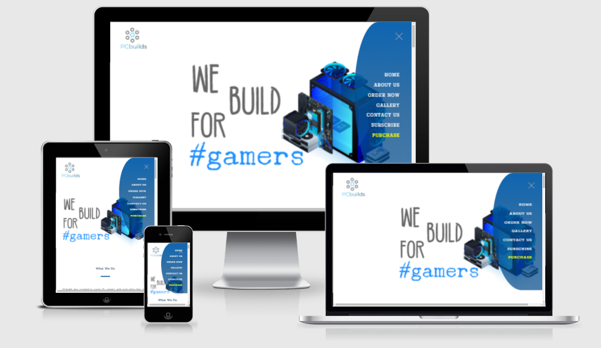

# PCbuilds

 PCbuilds is a company ....

     < picture here>

## Contents

- [**User Experience (UX)**](<#user-experience-(ux)>)

  - [Project Goals](#project-goals)
  - [User Goals](#user-goals)
  - [Design](#design)
  - [Wireframes](#wireframes)

- [**Features**](#features)

  - [Existing Features](#features)
  - [Features added then removed](#features)
  - [Features Left to Implement](#features)

- [**Technologies**](#technologies-used)

  - [Languages Used](#technologies-used)
  - [Frameworks, Libraries and Programs Used](#technologies-used)

- [**Testing**](#testing)

- [**Deployment**](#deployment)

- [**Credits**](#credits)

---

## User Experience (UX)

### Project Goals

> - Highlight the main values of our team to convince the customers to buy from us.
> - Showcase some of our previous PC designs, in order to attract the customer.
> - Obtaining subscriptions for mailing list, thereby increasing customer databases.
> - Directions to Facebook, Instagram and Twitter in order to get more customers.

### User Goals 

> - _"I don't have a PC or Laptop at home and so I mostly do my reaserch on a mobile phone"_
> - _"I want to see some of their previous PC designs before ordering"_
> - _"I want to get in touch with the company because i'd like to add some feature in a PC"_
> - _"I want to be able to subscribe to PCbuilds so I can get update on their future computers."_
> - _"I want to be able to join a facebook/instagram or twitter page so I can get to know the company"_
> - _"I would like to buy from them, but I'd love too see what else they offer"_

### Site Owner Goals :

> - Create a responsive website as some customers do not use different devices.
> - Create a gallery section where customers can navigate through pictures.
> - Create a "Contact Us" section, to assure customers we can always upgrade PC based on their needs.
> - Create a "Subscribe" card in order to keep subscribers up-to-date with our latest releases.
> - Create a Social links buttons at the end of the page so they can follow us.
> - Create a vast "Order here" page, with various PC builds and cart.

### Design

#### Colors

 For this project I decided to use only three colors, as the main focus was simplicity. 

